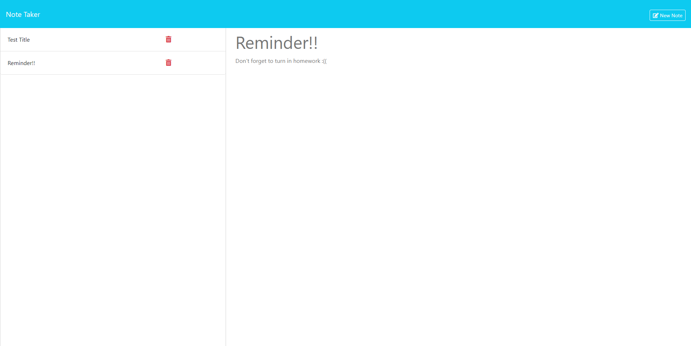

# Note Taker

## Description

This project utilizes front and back end coding. The purpose of the project is for the user to save notes using back end functionality.

## Usage

This project is run by the terminal, and using the command "node server.js." The user will be taken to the homepage, where a button will give them access to keep track of their notes. The user then can add a title and text associated, and allows them to save their note, and be able to go back and review the note for future instances. The user can also delete the note if it has no longer has relevance.

## Deployed

Heroku: https://lit-cove-29435-d6ea966cf272.herokuapp.com/